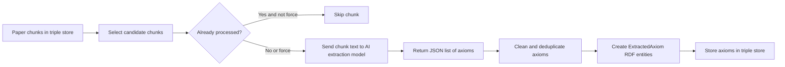
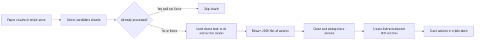
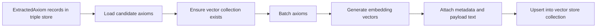
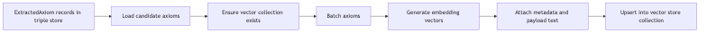
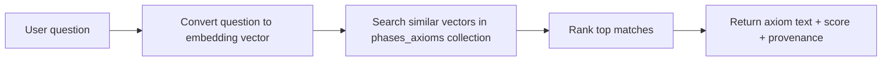
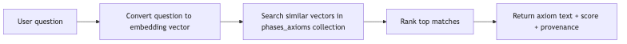

# Axioms Workflows (Non-Technical Guide)

This guide explains, in plain language, how three workflows work together:

1. `AxiomsWorkflow` (extract rules from text)
2. `AxiomsEmbeddingWorkflow` (turn rules into searchable vectors)
3. `AxiomsSearchWorkflow` (find the best matching rules for a question)

Source code references:
- `abi/src/phases/workflows/AxiomsWorkflow/AxiomsWorkflow.py`
- `abi/src/phases/workflows/AxiomsEmbeddingWorkflow/AxiomsEmbeddingWorkflow.py`
- `abi_/abi_phases/phases/workflows/AxiomsEmbeddingWorkflow/AxiomsEmbeddingWorkflow.py`
- `abi/src/phases/workflows/AxiomsSearchWorkflow/AxiomsSearchWorkflow.py`

---

## Why this exists

The system reads scientific content and turns it into reusable "if-then style" rules (called axioms). Once these rules are extracted, the system makes them searchable by meaning, not just by exact words.

Think of it as a 3-step pipeline:

- Step 1: Read text chunks and extract concise rules.
- Step 2: Convert those rules into numeric fingerprints.
- Step 3: Use a question to find the closest matching rules.

---

## 1) AxiomsWorkflow: extracting rules from paper chunks

### What goes in

- Existing paper chunks already stored in the knowledge graph (triple store).
- Optional filters (for example: only specific paper paths).

### What happens

- The workflow selects candidate chunks.
- If not forced, it skips chunks that were already processed.
- For each chunk, it asks an AI model to output a strict JSON list of axioms.
- It cleans and deduplicates the returned axioms.

### What comes out

- New `ExtractedAxiom` entries stored in the triple store.
- Each axiom keeps provenance (which chunk it came from, model used, prompt version, creation time).

### Business value

- Raw text becomes reusable knowledge statements.
- Every statement stays traceable to its source.

### Diagram

PNG version: `abi/src/phases/workflows/docs/diagrams/axioms-workflow.png`

---

## 2) AxiomsEmbeddingWorkflow: making axioms searchable by meaning

### What goes in

- Extracted axioms from the triple store.
- Collection settings (collection name, optional recreate, optional limit/path filters).

### What happens

- The workflow ensures the vector collection exists.
- It processes axioms in batches.
- For each axiom text, it computes an embedding vector.
- It upserts vectors plus metadata (axiom ID, source chunk, path, model info).

### What comes out

- A populated vector-store collection (default: `phases_axioms`).

### Business value

- The system can now match by semantic similarity (meaning), not only keywords.

### Diagram

PNG version: `abi/src/phases/workflows/docs/diagrams/axioms-embedding-workflow.png`

---

## 3) AxiomsSearchWorkflow: finding the most relevant axioms for a question

### What goes in

- A user prompt/question.
- Search settings (`top_k`, optional score threshold, collection name).

### What happens

- The prompt is embedded into a vector.
- The workflow searches the vector collection for similar vectors.
- It ranks the best matches.
- It prints each match with score and provenance metadata.

### What comes out

- A ranked list of matching axioms, including source details (chunk, path, IDs).

### Business value

- Users can ask natural-language questions and quickly get relevant rule-like statements.

### Diagram

PNG version: `abi/src/phases/workflows/docs/diagrams/axioms-search-workflow.png`

---

## End-to-end view

- `AxiomsWorkflow` creates structured axioms from paper chunks.
- `AxiomsEmbeddingWorkflow` turns those axioms into vectors.
- `AxiomsSearchWorkflow` lets users query those vectors with plain-language prompts.

In short: **extract -> embed -> search**.
