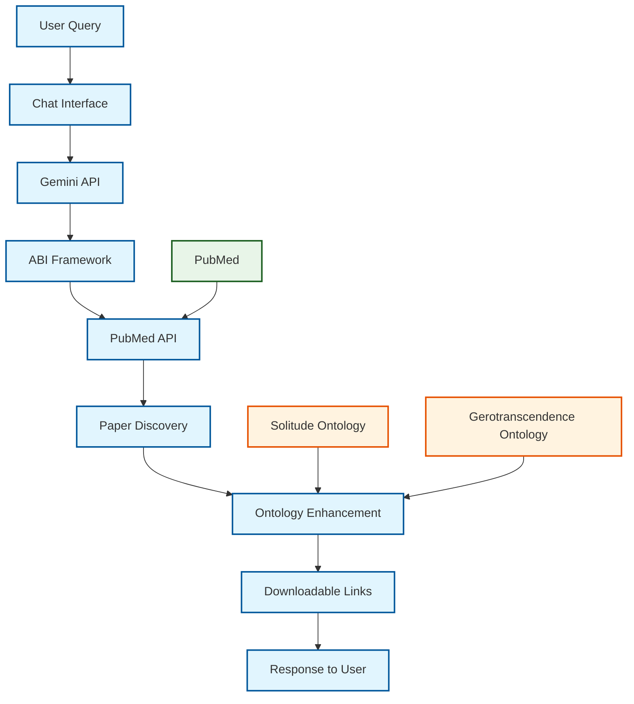
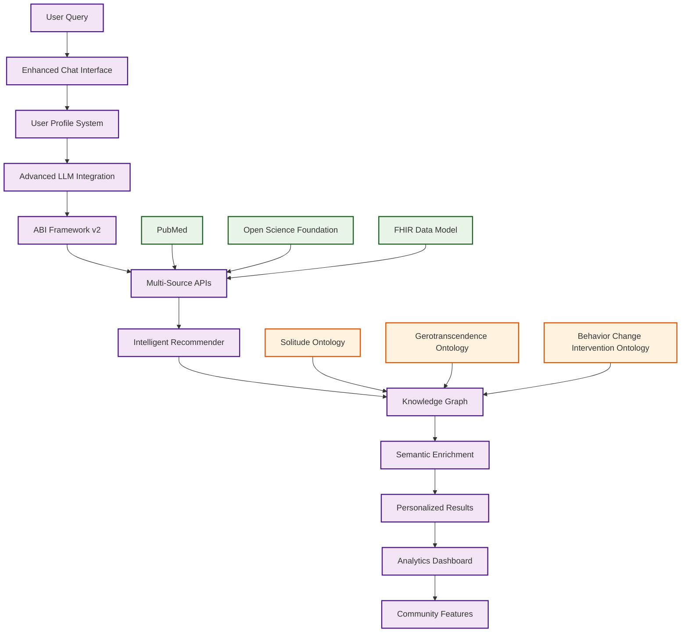

# Portal Development

The HealthyPhases website serves as our comprehensive research portal - a web-based platform designed to facilitate exploration, discovery, and analysis of solitude and gerotranscendence research through semantic enrichment and AI-powered tools.

## Portal Overview

In the context of the solitude and gerotranscendence literatures, the growth and complexity of research necessitates the development of efficient systems for organizing, accessing, and extracting insights from these research areas. We have created a new web portal through which researchers, clinicians, educators, and students may interact with semantically enriched solitude and gerotranscendence data.

## Core Services

The portal provides two major services to stakeholders:

### 1. Recommender System

A recommender system for solitude and gerotranscendence research provides automated recommendations for research themes, articles, and authors based on stakeholder profiles and preferences.

**Technical Approach:**
- Ontologies and knowledge graphs enrich the recommender system
- Reduces the need for large amounts of training data through formal specification of entities and relationships
- Provides robust explanations for recommendations through clear logical reasoning
- Hosted recommender system enriched by the ontologies developed in Aim 1
- Allows researchers to remain up-to-date on cutting-edge work in these respective fields

**Current Status:** In Development

### 2. Question-Answer System

A question-answer system for solitude and gerotranscendence research allows stakeholders to pose natural language questions about constructs, methods, and findings across solitude and gerotranscendence literatures.

**Current Technical Implementation:**
- **LLM Integration**: Gemini free API with basic system prompt
- **ABI Framework**: Open source Agentic Brain Infrastructure for API orchestration
- **PubMed Integration**: Direct API calls to retrieve and analyze research papers
- **Ontology-Driven Search**: Leverages solitude and gerotranscendence ontologies for enhanced paper discovery
- **Downloadable Links**: Provides direct access to research papers and resources

**Current Capabilities:**
- Natural language queries about solitude and gerotranscendence research
- PubMed paper discovery and retrieval
- Ontology-based search result enhancement
- Direct links to downloadable research papers

**Current Status:** Phase 3 Active - Access the Q&A system at [/chat](/chat)

## Portal Architecture

### Current vs Target State

**Legend:**
- 🔵 **Current State (Phase 3)**: Live functionality with Gemini API and PubMed integration
- 🟣 **Target State (Phase 4)**: Planned advanced features with user profiles and recommender systems
- 🟢 **Data Sources**: External APIs and data models
- 🟠 **Ontologies**: Semantic frameworks for knowledge representation

### Current State (Phase 3)

### Target State (Phase 4)

## Technical Architecture

### Data Integration
- **Data Sources**: PubMed (National Library of Medicine), Open Science Foundation
- **Data Model**: Fast Healthcare Interoperability Resources (FHIR) as common data model
- **Semantic Mapping**: Data mapped to Solitude Ontology and Gerotranscendence Ontology

### AI Components
- **LLM Integration**: Gemini API with ABI framework orchestration
- **PubMed API**: Direct integration for research paper discovery
- **Ontology Integration**: Solitude and gerotranscendence ontologies for enhanced search
- **Semantic Enrichment**: Ontological annotations and relationship mapping (in development)

### User Interface
- **Web Portal**: Accessible interface for researchers, clinicians, educators, and students
- **Natural Language Queries**: Support for complex questions about research constructs
- **Personalized Recommendations**: Profile-based article and author suggestions

## Development Progress

### Phase 1: Project Website (Completed)
- [x] Portal architecture design
- [x] Web portal development (this website)
- [x] Project documentation and research area descriptions
- [x] Basic website infrastructure and navigation

### Phase 2: Basic LLM Integration (Completed)
- [x] LLM integration with Gemini free API
- [x] Basic system prompt implementation
- [x] Open source ABI (Agentic Brain Infrastructure) framework integration
- [x] Initial chat interface at [/chat](/chat)

### Phase 3: PubMed API Integration (In Progress)
- [x] ABI framework enhancement for PubMed API calls
- [x] Ontology-based paper discovery and analysis
- [x] Natural language query processing for research questions
- [x] Paper retrieval and downloadable link generation
- [ ] Advanced semantic enrichment of search results
- [ ] Enhanced ontology-driven recommendations

### Phase 4: Advanced Features (Planned)
- [ ] Recommender system implementation
- [ ] User accounts and personalized profiles
- [ ] Advanced analytics and research trend analysis
- [ ] Community features and collaboration tools

## Access and Usage

The HealthyPhases portal is live and available for use by the research community:

- **Free Access**: Open-access platform available at [healthyphases.org](https://healthyphases.org)
- **Q&A System**: Interactive chat interface at [/chat](/chat) with PubMed integration
- **Research Documentation**: Comprehensive resources and ontology information
- **Community Resources**: Publications, training materials, and research areas
- **Current Capabilities**: 
  - Natural language queries about solitude and gerotranscendence research
  - PubMed paper discovery and retrieval
  - Direct links to downloadable research papers
  - Ontology-enhanced search results

## Future Enhancements

- **Open Source Release**: Complete opening of the current private repository with ABI framework implementation
- **Multi-language Support**: International research collaboration
- **Collaboration Tools**: Research team features and sharing capabilities
- **Analytics Dashboard**: Usage statistics and research trend analysis

## Contributing

We welcome contributions from the research community to improve the portal's functionality and content. Please see our [Contributing Guidelines](../CONTRIBUTING.md) for more information.
